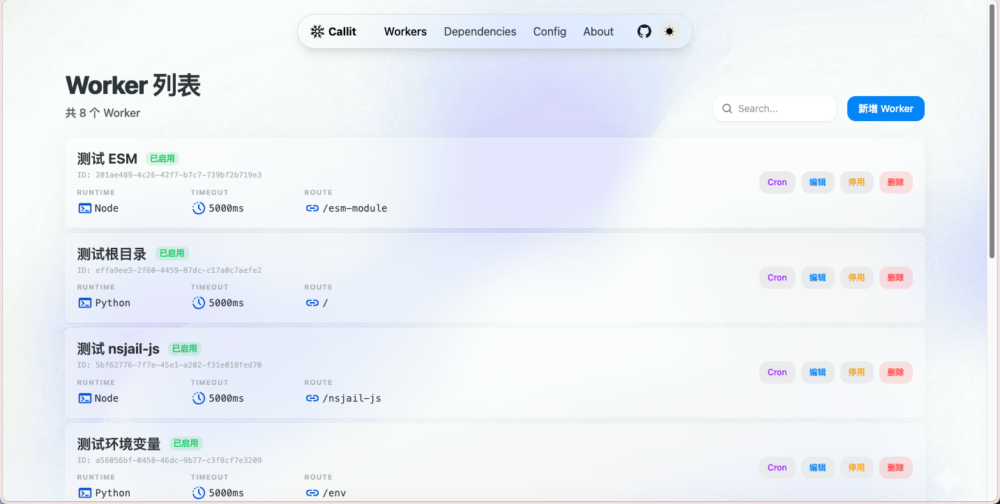
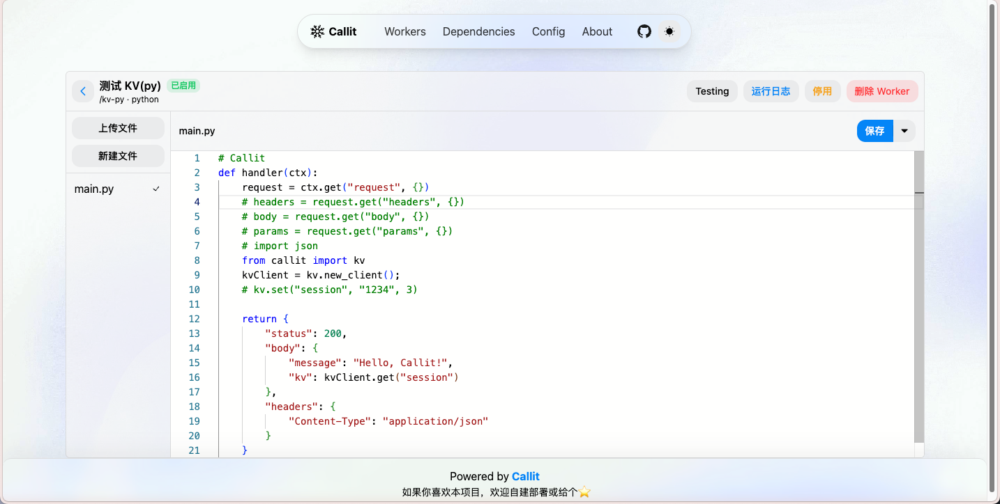

# Callit
A lightweight self-hosted personal serverless platform based on Docker.  
轻量级、自建、基于 Docker 的个人 Serverless 平台。

`Callit` 允许你通过 Python 或 Node.js 编写 Worker，并通过 HTTP 路由触发执行，适合轻量 API、HTML 页面展示、个人自动化等服务。

<div style="width: 100%; display: flex; gap: 10px; text-align: center; padding: 20px;">
  <a href="#快速开始" 
    style="padding: 8px 14px; background-color: #007bff; color: white; border-radius: 8px; text-decoration: none;"
    target="_blank" rel="noreferrer">
      Quick Start
  </a>
  <a href="./docs/README.md" 
    style="padding: 8px 14px; background-color: #e600ff; color: white; border-radius: 8px; text-decoration: none;"
    target="_blank" rel="noreferrer">
      Documentation
  </a>
</div>

## 屏幕截图



## 核心能力
不依赖 Docker、Kubernetes 等容器技术，提供开箱即用的 Serverless 体验  
快速开发，支持热更新 Worker 函数  

- 基于 HTTP 路由触发 Worker
- 支持 Python / Node.js 运行时
- 支持文件上传、文件返回、HTML 页面返回
- 支持全局依赖管理
- 内置 Admin 后台管理 Worker、配置和依赖

tips:
> 如果你需要一个更成熟、功能更丰富且适用于企业级的 Serverless 平台，应该考虑 OpenFaas、Fission、AWS Lambda、Cloudflare Workers 等解决方案。`Callit` 更适合个人开发者、轻量级使用场景。

## 快速开始

### Docker Compose (推荐)

```yaml
services:
  callit:
    image: yangzxi/callit:latest
    container_name: callit
    environment:
      - ADMIN_TOKEN=   # 在生产环境中请设置一个强随机值
      # - TZ=Asia/Shanghai
    ports:
      - "3100:3100"
    volumes:
      - ./data:/app/data
    cap_add:
      - SYS_ADMIN
    security_opt:
      - seccomp=unconfined
      - apparmor=unconfined
      - systempaths=unconfined
    restart: unless-stopped
```

启动：

```bash
docker compose up -d
```

启动后可访问：

- Router: `http://127.0.0.1:3100`
- Admin: `http://127.0.0.1:3100/admin`

### Skill 与 MCP 服务
如果你希望在 AI agent 中通过自然语言的方式来管理 Callit Worker，可以安装 `callit-skill`，并确保配置了 `callit-mcp` MCP 服务。  

在新的 session/thread 中将以下内容发送给你的 AI agent 来安装 `callit-skill`：
```text
Fetch and follow instructions from https://raw.githubusercontent.com/YangZxi/Callit-skill/refs/heads/main/README.md to install the skill.
```

更多关于该 skill 的介绍请参考 [Callit-skill](https://github.com/YangZxi/Callit-skill)

#### MCP
项目内置了一个简单的 MCP server，你需要通过登录到 Admin 后台来启用它，并设置一个`MCP_TOKEN`，AI agent 才能通过 MCP 来管理 Worker。
- MCP Server Name: `callit-mcp`
- MCP Server Url: `http://<host>/mcp`，其中 `<host>` 是 AI agent 能访问到的地址，通常是部署 Callit 的服务器 IP 或域名

## Worker 模板

### Python Worker 模板

```python
def handler(ctx):
    request = ctx.get("request", {})

    return {
        "status": 200,
        "body": {
            "message": "Hello, Callit!",
            "request": request
        },
        "headers": {
            "Content-Type": "application/json"
        }
    }
```

### Node Worker 模板

```javascript
function handler(ctx) {
  const { request } = ctx;

  return {
    status: 200,
    body: {
      message: "Hello, Callit!",
      request,
    },
    headers: {
      "Content-Type": "application/json"
    }
  };
}
```

说明：

- Worker 目录中必须包含 `main.py` 或 `main.js`
- 主文件中必须定义 `handler(ctx)`，通过 ctx 对象获取请求信息、上下文等信息
- 通过返回 JSON 结构化数据来控制 HTTP 响应的状态码、响应体和响应头
- 具体文档与样例请参考 [Worker 文档](./docs/worker_introduction.md)


## 技术栈

- Backend: Go + Gin
- Frontend: React + Vite + HeroUI
- Database: SQLite3
- Runtime: Python3 / Node.js


## 二次开发

如果你需要本地修改源码、调试前端或开发后端，可按下面方式启动。

### 1. 安装 Docker
编辑 `docker-compose.dev.yml`，并配置相应的环境变量

### 2. 启动前端

```bash
cd pages
pnpm install
pnpm run dev
```

### 3. 启动后端

```bash
docker compose -f docker-compose.dev.yml up --build
```
后端数据默认保存在 `data/` 目录下

默认前端端口为 `3180`。
默认后端端口为 `3100`。

## 数据目录

- `data/app.db`：SQLite 数据库
- `data/workers/<worker_id>/`：Worker 文件目录
- `data/tmp/<request_id>/`：上传文件临时目录，请求结束后自动清理，根目录可由 `WORKER_RUNNING_TEMP_DIR` 配置
- `data/.lib/<runtime>/`：运行时全局依赖目录
- `public/`：Admin 前端构建产物目录

## 常见使用场景

- 编写 JSON API
- 上传文件后做解析或处理
- 生成并返回文件
- 返回 HTML 页面
- 使用第三方依赖扩展 Worker 能力
